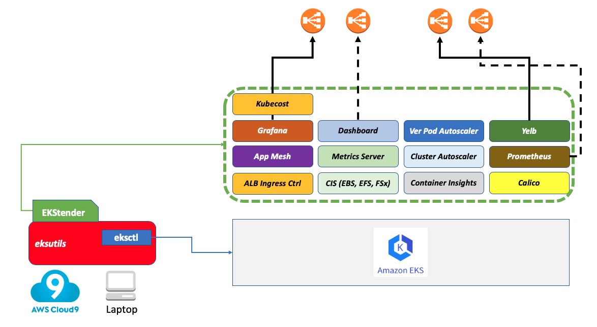

#### What is it?

`EKStender` is a tool that extends a vanilla Amazon EKS cluster with a number of add-on OSS projects.

#### What problem does EKStender solve?

The tool is aimed at bridging the gap that exists between a vanilla K8s deployment (too basic for some operational requirements) and very opinionated platforms built on top of K8s (too opinionated for many use cases).

`EKStender` is not intended to be a production tool nor a product per se. It is more of a prototype (or EKSperiment?) that intercept the needs of developers and IT of building something that sits in between a CaaS and a PaaS (for lack of better terminology). 

Without `EKStender` users of EKS would need to deploy manually the add-on components they need. `EKStender` automates those tasks by enabling said tools. See below for a list of these add-ons.  

#### What's the status of EKStender?

In its current shape and form EKStender is a useful tool for tests and demonstrations.

The bash code included in `ekstender.sh` is no magic and comes from multiple sources (mostly from the EKS documentation). Each module of the bash script has a pointer to the source documentation that has been used. 

While you can make it work with a regular upstream K8s setup, `EKStender` was only tested with Amazon EKS (and in particular with setups done with [eksctl](https://github.com/weaveworks/eksctl)).

#### What stack does EKStender deploy?

This is a list of modules, features and configurations that `EKStender` can enable on a vanilla EKS cluster (deployed with eksctl):

- Calico 
- Metrics server
- CSI EBS drivers
- CSI EFS drivers
- CSI FSx drivers
- ALB ingress controller
- Cluster autoscaler
- Vertical pod autoscaler
- Kubernetes dashboard
- Prometheus
- Grafana
- CloudWatch Container Insights
- AppMesh controller and sidecar injector
- Demo application ([Yelb](https://github.com/mreferre/yelb))

In addition to the above, a multi-purpose `eks-admin` Service Account is created: it can be used to login into the Dashboard via grabbing its token. Note also that some of these add-ons can be enabled/disabled. Look at the `USER INPUTS` section of the `ekstender.sh` script to check for what is enabled and what not. In addition, when you launch the script a summary will show what it will install.

The following picture shows a graphical representation of the outcome of running `EKStender`



#### What other modules and tools are under consideration?

Any feedback re what you want to see?

#### Getting started

People that want to start experimenting with EKStender need to follow the following prescriptive flow. 

Start a shell with [eksutils](https://github.com/mreferre/eksutils) (a utility that embedds all the required system tools that the script assumes are available). The syntax below starts a shell importing into the container the local AWS CLI and Kubernetes environments so they persist if you need to restart the container. If you want to create an ephemeral environment remove the two `-v` mappings: 

```
docker run -it --rm -v $HOME/.aws:/root/.aws -v $HOME/.kube:/root/.kube mreferre/eksutils:latest
```

From within the container shell, create a brand new cluster with `eksctl`. You can pick any cluster name. `EKStender` works with cluster versions 1.14 and 1.15 but the demo application points to a YAML that only works with K8s 1.16 (due to the API changes in that release). 

```
eksctl create cluster --name=eks1 --nodes=3 --nodes-min=2 --nodes-max=6 --ssh-public-key=<key name> --region=<region> --asg-access --version=1.16
```

Note that if you have access to multiple kubernetes cluster from the environment you are working on you need to make sure this cluster above is the default one (i.e. kubectl will point to it by default).

Clone the EKStender project:

```
git clone https://github.com/mreferre/ekstender
```

Move inside the `ekstender` directory.

From here you can run `./ekstender.sh <cluster name>`. This cluster name is the name you have used with the eksctl command. This will run with default configurations that will be displayed by the script for a final check.  

EKStender will default to the region configured with the AWS CLI. If for some reasons you need to change it (because you created the cluster in a different region) you can force it by exporting a `REGION` variable before starting the script.

The script no longer requires setting the variables `CLUSTERNAME`, `AUTOSCALINGGROUPNAME` and `NODE_INSTANCE_ROLE`. The cluster name is read as the input parameter when you launch the script. The other two values will be programmatically extracted by querying `EKSCTL` and `Cloudformation`. Clusters with multiple nodegroups are not supported at the moment.

`EKStender` should work from other shells (provided you have all the tools configured e.g. kubectl, AWS CLI, jq, helm, etc. etc.). Note that `EKStender` logs by default to a file called `ekstender.log` in the directory where you launch it. If you use it from within `eksutil` note that the file will not persist when you exit the container (you can easily fix it by mounting a directory and log there instead).

The script is designed to be idempotent. 

This is an example of what the setup page looks like:


#### Clean up 

The repo includes an experimental `cleanup_ekstender.sh <cluster name>` script that is intended to roll-back the setup of the `EKStender` components. Never run this cleanup script (nor `./ekstender.sh` for that matter) on a production cluster and in a production account. The clean up script is primarely used to get back to a status which will allow to remove the cluster (using `eksctl delete cluster --name <clustername>`)

From within the ekstender directory run:

```
./cleanup_ekstender.sh <cluster name>
```

If you want to remove the cluster, you should now be able to run:

```
eksctl delete cluster --name eks1
```

#### Known issues and limitations

- EKS/Fargate is not supported.
- Only one single node group per cluster is supported.
- If you enabled Calico (by default it is not enabled) the cleanup script will not delete the iptables on the nodes. Either follow [these steps](https://github.com/projectcalico/calico/blob/master/hack/remove-calico-policy/remove-policy.md) or re-deploy the node group (or kill the instances and let ASG re-deploy them).  

